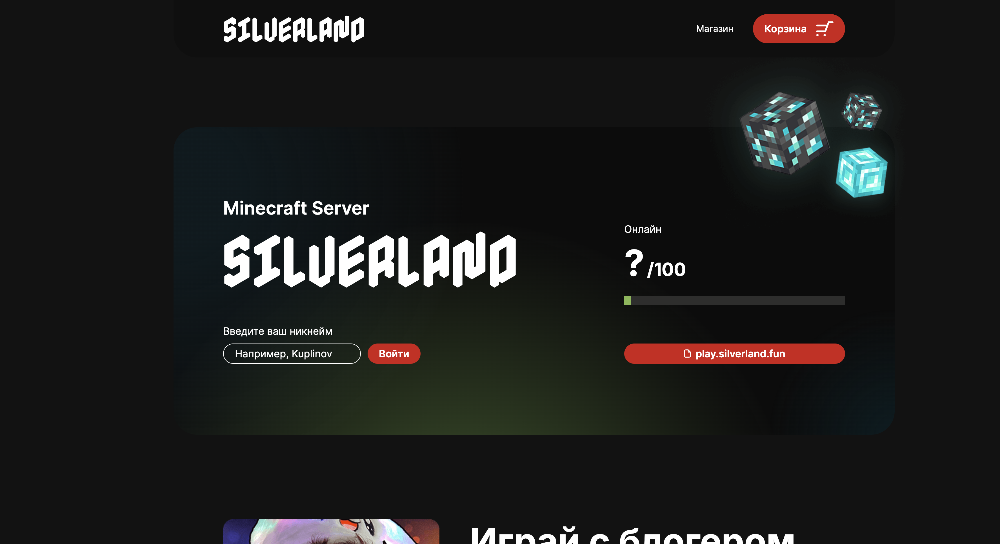

# SilverLand Frontend


Фронтенд донат-магазина Minecraft-сервера SilverLand: каталог товаров, корзина, промокоды и скидки, личный кабинет и полноценная админка.



Это пет-проект с энтерпрайз-подходами: строгий TypeScript, архитектурные правила, которые проверяет линтер, визуальные регрессионные тесты и автогенерация типов из бэкендовой OpenAPI-спеки.

## Что внутри

- Магазин с карточками товаров, корзиной и оформлением покупки
- Промокоды и скидки, которыми администратор управляет из интерфейса
- Авторизация и привязка покупок к игровому аккаунту
- Админ-панель: товары, скидки, промокоды, история покупок
- Виджеты главной страницы: онлайн сервера, карточки-завлекалки, блок «поиграй с блогером»

## Архитектура

Код организован по [Feature-Sliced Design](https://feature-sliced.design/):

```
src/
├── app/         # Инициализация, глобальные провайдеры, роутинг
├── pages/       # Страницы (магазин, админка, авторизация, ...)
├── widgets/     # Композитные блоки страниц
├── features/    # Сценарии бизнес-логики
├── entities/    # Бизнес-сущности (товар, корзина, промокод, ...)
└── shared/      # Переиспользуемый код: UI, утилиты, API
```

## Стек

React 18 + TypeScript 5.3, сборка на Vite 6. Состояние на MobX, роутинг на React Router 6, запросы через Axios, стили на scss-модулях.

Типы API не пишутся руками: `swagger-typescript-api` генерирует их из OpenAPI-спеки бэкенда, так что рассинхрон с сервером ловится на этапе компиляции.

## Качество

- Unit-тесты на Vitest и Testing Library
- Storybook 8 как каталог UI-компонентов
- Визуальные регрессионные тесты на Loki: скриншоты в трёх конфигурациях (десктоп 1920, ноутбук 1366 и iPhone 7) сравниваются в Docker-хроме, отчёт собирается в HTML
- ESLint, Stylelint и Prettier с общими конфигами, всё в режиме `--max-warnings=0`
- Knip находит мёртвый код и неиспользуемые зависимости
- Sentry собирает ошибки с продакшена
- Git-хуки прогоняют lint-staged перед каждым коммитом, CI на GitHub Actions проверяет каждый push

## Запуск

Понадобится Node.js 18+ и pnpm 9.10+ (npm тоже подойдёт).

```bash
git clone git@github.com:SilverLandMc/minecraft-silver-frontend.git
cd minecraft-silver-frontend
pnpm install
pnpm start
```

Приложение поднимется на `http://localhost:3000`.

При желании можно создать `environments/.env` и подключить Sentry:

```env
SENTRY_DSN=https://...ingest.sentry.io/...
STAND_NAME=Имя стенда
RELEASE_NAME=Версия релиза
ENV_NAME=Имя окружения
```

## Команды

| Команда | Что делает |
|---|---|
| `npm run start` | dev-сервер на порту 3000 |
| `npm run build` | продакшен-сборка |
| `npm run storybook` | Storybook на порту 3010 |
| `npm run test` | unit-тесты |
| `npm run test:ui` | визуальные тесты (Loki) |
| `npm run test:ui:approve` | принять изменения скриншотов |
| `npm run lint` | ESLint + Stylelint + tsc параллельно |
| `npm run knip` | поиск неиспользуемого кода |
| `npm run typescript:swagger` | перегенерация типов API из спеки |
| `npm run generateDependenciesGraph` | SVG-граф зависимостей проекта |
